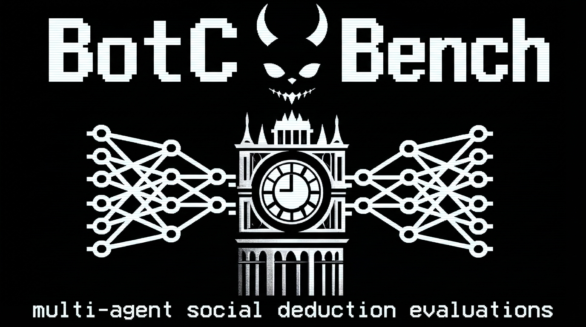

<p align="center">
  
</p>

# BotC Bench

**Multi-agent social deduction evaluations** — Up to 15 AI agents (Claude, GPT, Gemini) play [Blood on the Clocktower](https://bloodontheclocktower.com/) against each other in a fully automated benchmark for deception and detection.

## What This Is

A benchmark platform for evaluating LLM agents' ability to deceive and detect deception in social deduction games. Agents claim roles, share information, form alliances in breakout groups, whisper secrets, nominate suspects, and vote to execute — all while the Demon hides among them, killing by night.

**Key features:**
- **Multi-provider**: Anthropic Claude, OpenAI GPT, Google Gemini agents compete in the same game
- **Full BotC rules**: 20+ Trouble Brewing roles, proper nomination/voting, breakout groups, whispers, ghost votes
- **RECALL memory system**: Agents write self-notes and search past conversations (no full context accumulation)
- **Monitor Agent**: Post-hoc deception detection benchmark — a separate LLM watches public events and tries to identify evil players
- **Pixel-art web UI**: Live observation with DX Terminal sprites, waypoint pathfinding, speech bubbles, voting overlays
- **Voice acting**: ElevenLabs TTS with unique voices per character
- **Speech styles**: Play games in Shakespearean iambic pentameter, film noir, pirate speak, and more

## Quick Start

```bash
# Backend
cd backend
pip install -e ".[dev]"
cp .env.example .env  # Add your API keys
uvicorn botc.main:app --port 8000

# Frontend
cd frontend
npm install
npm run dev  # http://localhost:5173
```

Navigate to the lobby, pick your models, and start a game.

## Architecture

```
backend/           Python 3.13, FastAPI, asyncio
  botc/engine/     Pure deterministic game logic (seeded RNG, all 20 TB roles)
  botc/llm/        Provider abstraction (Anthropic, OpenAI, Google)
  botc/comms/      Visibility engine, breakout groups, whispers, RECALL memory
  botc/orchestrator/ Async game loop, agent wrapper, rate limiting
  botc/monitor/    Post-hoc deception detection benchmark
  botc/api/        REST + WebSocket for live observation
  botc/tts/        ElevenLabs voice generation
frontend/          React 19, Vite, TypeScript, Zustand
  components/      TownMap, ConversationPanel, MonitorPanel, GameLobby
  stores/          Zustand game state with event sourcing
  hooks/           WebSocket connection, replay controller
```

## Monitor Agent

Run a "monitor" LLM against completed games — it watches only public information (no night actions, no private messages, no roles) and rates each player 0-100 on how likely they are to be evil. Scores combine alignment accuracy, bet timing, and ROC-AUC.

```bash
# Via API
curl -X POST http://localhost:8000/api/games/{game_id}/monitors \
  -H 'Content-Type: application/json' \
  -d '{"provider": "anthropic", "model": "claude-sonnet-4-20250514"}'

# Results streamed via WebSocket, saved to backend/games/monitor_*.json
```

Compare models head-to-head: run Haiku, Sonnet, and GPT on the same game, then switch between results in the monitor panel.

## Game Flow

```
SETUP → FIRST_NIGHT → DAY_DISCUSSION → BREAKOUT_GROUPS ⟷ REGROUP
  → NOMINATIONS → VOTING → EXECUTION → NIGHT → (repeat)
  → GAME_OVER (when Demon executed or 2 players remain)
```

## License

Research use. BotC game mechanics are property of The Pandemonium Institute.
